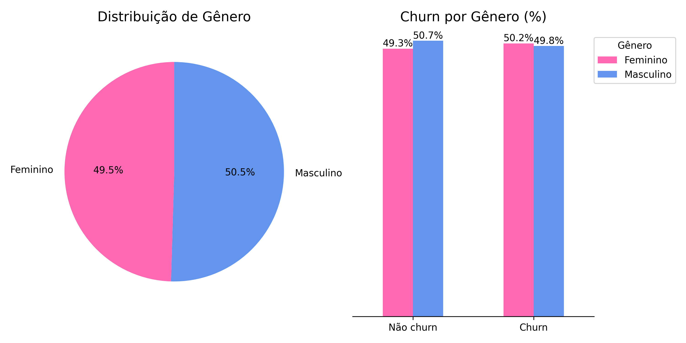
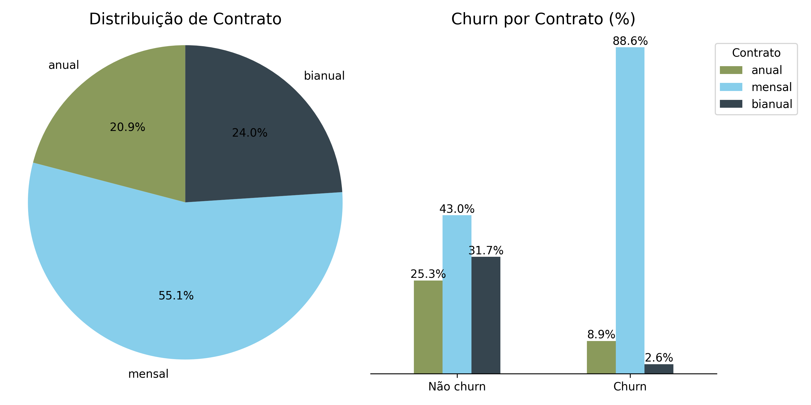
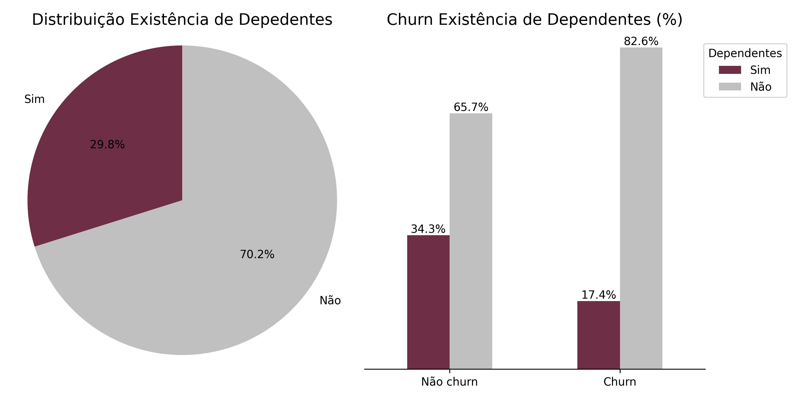
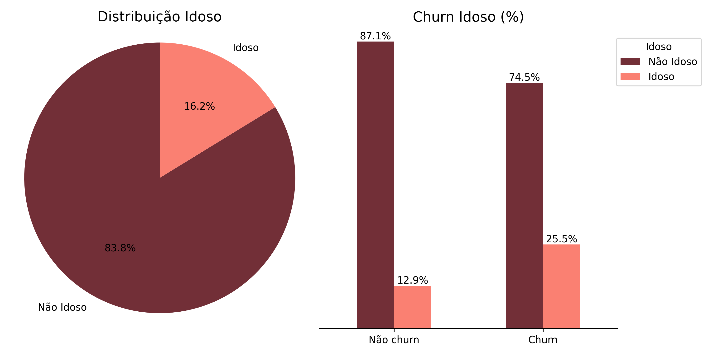
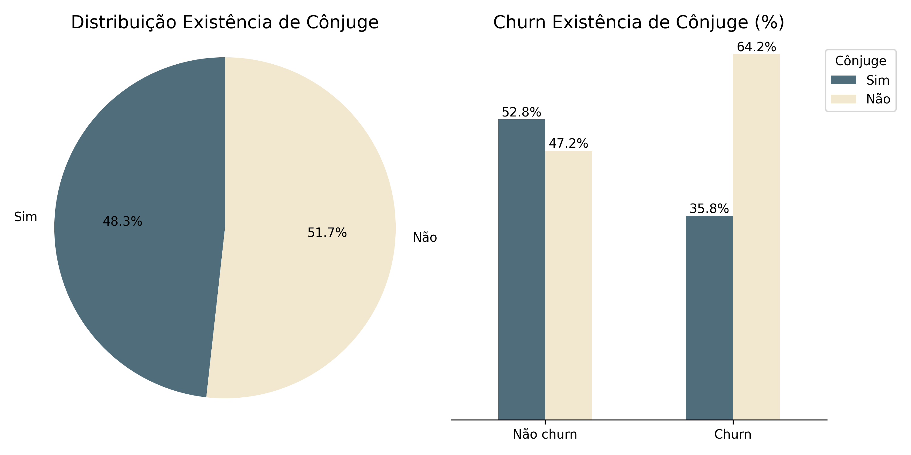
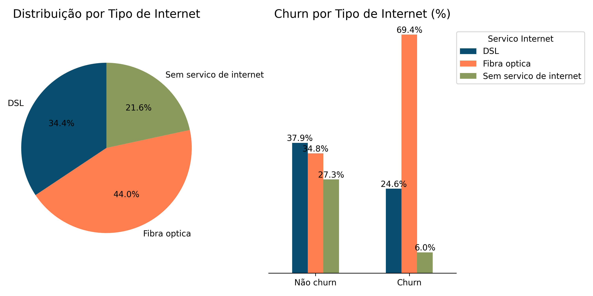
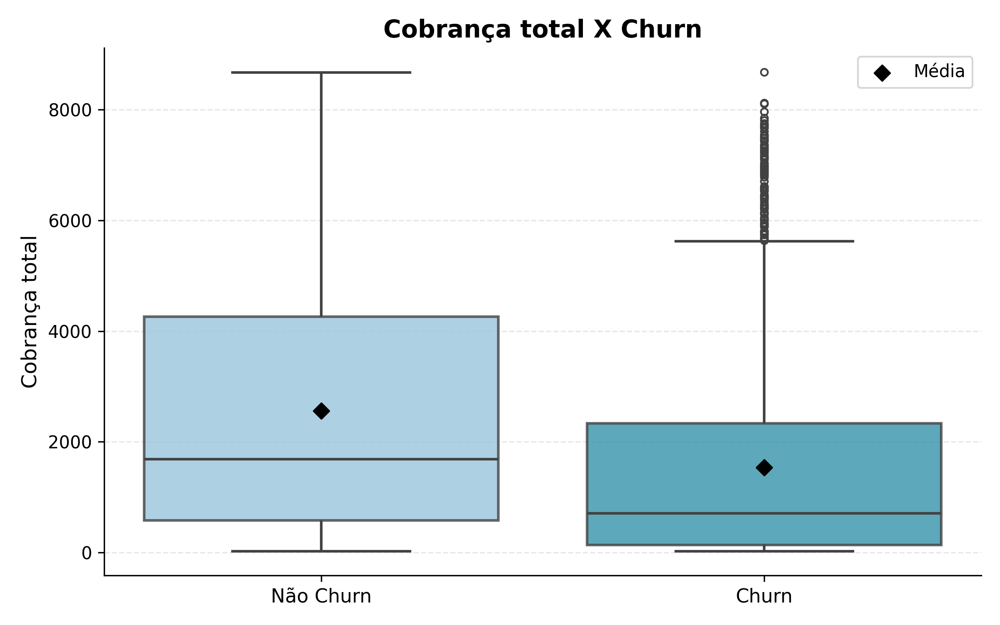
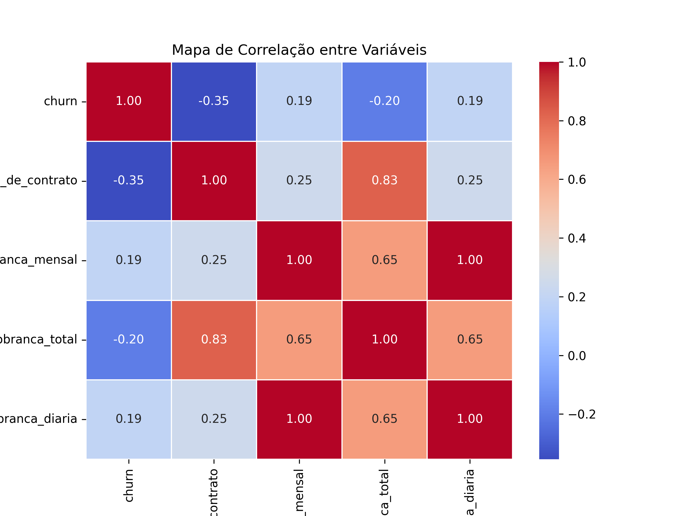

# TelecomX - Análise de Churn

Este projeto tem como objetivo analisar a evasão de clientes (churn) na empresa fictícia TelecomX, a partir de dados reais e abordagens de ciência de dados. Por meio da identificação de padrões de cancelamento, pretende-se propor estratégias eficazes de retenção que auxiliem a empresa a reduzir perdas e fortalecer a relação com seus clientes.

## Estrutura do Projeto

- `TelecomX_BR.ipynb`: Notebook principal com todo o fluxo de extração, transformação, análise e visualização dos dados.
- `TelecomX_Dados.csv`: Base de dados processada.
- `TelecomX_Dados_Limpos.csv`: Base de dados transformados e limpos.
- `TelecomX_dicionario.md`: Dicionário de dados com explicação de cada coluna.
- `img/`: Pasta com gráficos e visualizações gerados durante a análise.

## Como Executar

1. Instale as dependências
   ```sh
   pip install pandas matplotlib seaborn
   ```
2. Abra o arquivo [`TelecomX_BR.ipynb`](TelecomX_BR.ipynb) no Jupyter Notebook ou no Visual Studio Code.
3. Execute as células sequencialmente para realizar a extração, transformação, análise e visualizar os gráficos.
4. O arquivo [`TelecomX_Dados.csv`](TelecomX_Dados.csv) será gerado automaticamente durante o processo, assim como o arquivo [`TelecomX_Dados_Limpos.csv`](TelecomX_Dados_Limpos.csv)

## Dicionário de Dados

Consulte [`TelecomX_dicionario.md`](TelecomX_dicionario.md) para detalhes sobre cada coluna do dataset.


## Limpeza e Tratamento de Dados
- **Padronização**:
Colunas renomeadas para letras minúsculas e traduzidas para o português para facilitar a análise.
- **Valores Categóricos**:
Tradução de categorias como contrato, método de pagamento, serviço de internet e gênero para o idioma local.
- **Dados Duplicados e Nulos**:
Remoção de registros duplicados e incompletos. A coluna cobranca_total foi convertida para tipo numérico com tratamento de erros.
- **Variáveis Binárias**:
Normalização de colunas binárias (churn, tem_conjuge, etc.) com conversão para valores numéricos: 1 = “sim”, 0 = “não”.


## Análise Exploratória (EDA)

<p align="center">
    
    
</p>
<p align="center">
    
    
</p>
<p align="center">
    
    
</p>
<p align="center">
    
</p>

- Contrato mensal e fibra óptica estão ligados a maiores taxas de evasão.
- Clientes idosos, sem cônjuge ou sem dependentes apresentam maior propensão ao churn.
- Cheque eletrônico como método de pagamento está associado a maior churn; transferência automática indica menor risco.
- Menor tempo de contrato e baixa cobrança total correlacionam-se com maior evasão.
- Gênero não mostrou influência significativa no churn

### Correlação

<p align="center">
    
</p>

- Churn × Tempo de contrato (−0.35):
Clientes com contratos mais longos cancelam menos → Fidelização reduz churn.
- Churn × Cobrança mensal/diária (+0.19):
Tarifas mais altas aumentam levemente o churn → Avaliar valor percebido.
- Tempo de contrato × Cobrança total (+0.83):
Clientes antigos geram mais receita → Priorizar retenção desses clientes.
- Cobrança mensal × Cobrança diária (+1.00):
Correlação perfeita → Variáveis redundantes, manter apenas uma.


## Principais Insights
- Contrato mensal: maior risco de churn.
- Idosos: mais propensos a cancelar.
- Sem cônjuge/dependentes: maior evasão.
- Fibra óptica: associada a churn elevado.
- Cheque eletrônico: método de pagamento com maior churn.
- Menor tempo de contrato e cobrança total: indicam menor engajamento.

## Recomendações
- Focar retenção em clientes com contrato mensal.
- Criar ações específicas para idosos e clientes sem vínculos familiares.
- Incentivar métodos de pagamento automáticos.
- Monitorar clientes com pouco tempo de contrato e baixo valor de cobrança.